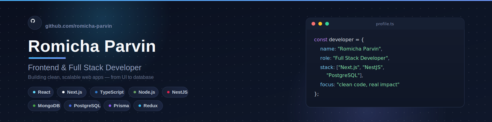

  

  

  
  
  
  

 

## About Me

I'm a Frontend & Full Stack Developer from Bangladesh, working primarily across the **React / Next.js** ecosystem on the frontend and **Node.js / NestJS** on the backend.

- 🎓 Diploma in Computer Technology — Rangpur Polytechnic Institute
- 🛠️ Frontend: React.js, Next.js, TypeScript, Redux Toolkit, Tailwind CSS
- ⚙️ Backend: Node.js, Express.js, NestJS, PostgreSQL, Prisma, MongoDB
- 🎯 Currently exploring: authentication patterns, API design, and system architecture at scale

 

## Tech Stack

  

  

  

 

## GitHub Analytics

  
  

  

 

## Featured Project

  

<h3 align="center">ERP System — HR Management</h3>

  A full-stack ERP platform for managing staff, payroll, inventory and procurement — built as a production-style, multi-module system.

  
  
  
  

  

  

 

  

